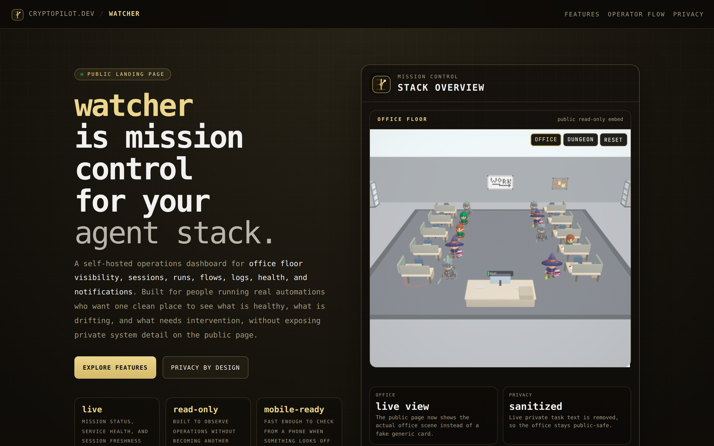

# Watcher

Mission control for multi-agent operations.

Website: https://cryptopilot.dev/watcher



## What It Is

Watcher is a self-hosted operations dashboard for agent systems. It gives operators one place to monitor system health, team activity, and execution state, then intervene from the web UI when needed.

## Core Capabilities

- Live mission status with system-level health context
- Interactive 3D Team Office scene with two swappable styles:
  - **Office** — voxel-art modern workspace with workstations, break area, wall fixtures (MariaIsMe voxel pack)
  - **Dungeon** — medieval tavern with stone walls, torches, banners, treasure chest (KayKit Dungeon pack)
- Rigged character avatars (KayKit Adventurers: Knight, Barbarian, Mage, Rogue) with idle / walk / sit-at-desk / hit-reaction animations
- Camera controls: overview / focus / free pan (desktop arrow grid + mobile toggle)
- Authenticated web lane control (select lane, send instruction)
- Live session feed (user, agent, tool events)
- Task runs and flow tracking
- Logs and process visibility
- Telegram sync support
- Mobile-friendly dashboard experience with toggleable pan controls

## Product Surfaces

- `/watch` — primary operations dashboard
- `/office-preview` — public read-only office visualization
- `/docs` — in-app reference

## Security Model

- Authenticated dashboard access
- Public preview intentionally sanitized (no private task text)
- Runtime secrets are environment variables and are not stored in this README

## Tech Stack

- Next.js 14
- React
- TypeScript
- Three.js / react-three-fiber / @react-three/drei
- OBJ + GLB asset loaders (three-stdlib)

## 3D Assets

All third-party 3D assets used in the scenes are CC0 / free commercial-use:

- **KayKit Character Pack: Adventurers** (CC0) — rigged adventurer models with animations
- **KayKit Dungeon Remastered** (CC0) — dungeon floor tiles, walls, banners, torches, barrels, chest, pillars
- **MariaIsMe 3D Voxel Office Pack** — office furniture (desks, chairs, cubicles, cabinets, coffee machines, plants, wall art)

Assets are not checked into the repo — they're downloaded on setup by `scripts/fetch-models.sh` (KayKit from GitHub, MariaIsMe from itch.io). Output goes to `public/models/{chars,env,voxel}`, which is gitignored.

## Setup

```bash
# 1. install deps
npm install

# 2. fetch 3D assets (idempotent; skips anything already present)
bash scripts/fetch-models.sh

# 3. copy env template and set WATCH_PASSWORD + optional Telegram token
cp .env.example .env.local
# edit .env.local

# 4. run dev
npm run dev
```

If `fetch-models.sh` can't reach itch.io for the voxel office pack, it prints a fallback note with the manual download URL — just drop the OBJ zip into `public/models/voxel/` and re-run.

## Development

```bash
npm run dev
```

## Build

```bash
npm run build
npm run start
```

