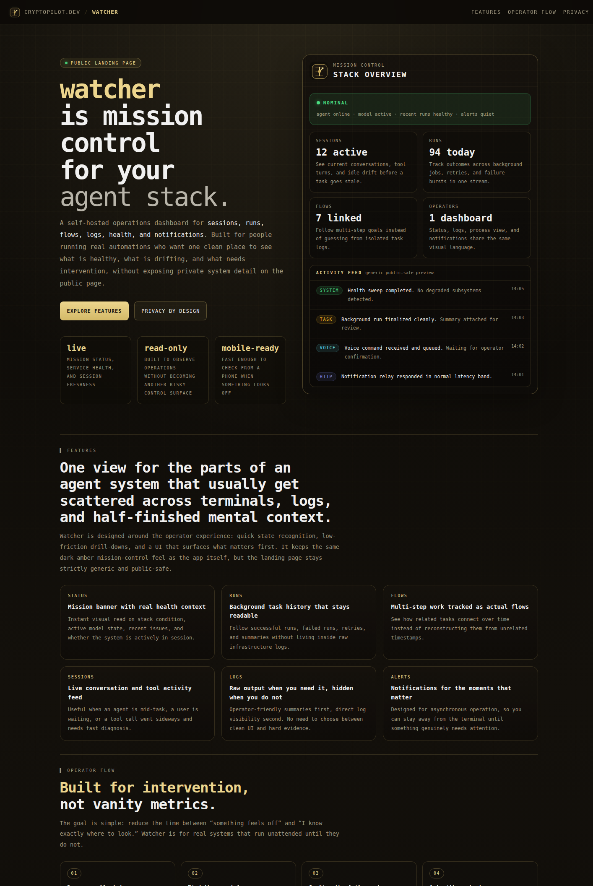

# CLAWNUX Watch

Private mission-control dashboard for the OpenClaw agent stack.



## Overview

CLAWNUX Watch is a Next.js monitoring app that gives a live, consolidated view of everything
OpenClaw is doing — active Telegram sessions, task runs, flows, cron jobs, auth state, and
Snapmolt voice/HTTP activity — in a single password-gated dashboard.

It provides:

- **Mission status banner** — color-coded NOMINAL / DEGRADED / FAULT with pulsing "in session" indicator
- **Live session feed** — real-time Telegram conversation turns (user → agent → tool) from the active session JSONL, newest first
- **Health cards** — per-subsystem status: agent, auth providers, session staleness
- **Task runs** — full history from `runs.sqlite` with terminal summaries and error details
- **Flows** — multi-step flow runs from `flows/registry.sqlite`
- **Cron** — recent cron job executions from `cron/runs/*.jsonl`
- **Snapmolt mirror** — tagged voice/HTTP/event activity with breakdown chart
- **PM2 processes** — process table and live log tail
- **Auth state** — per-provider token health (anthropic, openai, telegram, etc.)
- **Version + model badge** — always-visible OpenClaw version and active model
- Mobile-optimised, PWA-installable (`start_url: /watch`, maskable icons)
- Password-gated with `WATCH_PASSWORD`; `watch_access` cookie valid 30 days

## Environment

Create `.env.local` from `.env.example` and set:

| Variable | Purpose |
|---|---|
| `WATCH_PASSWORD` | Required — gates all routes |
| `WATCH_TELEGRAM_BOT_TOKEN` | Telegram bot for periodic status pings |
| `WATCH_TELEGRAM_CHAT_ID` | Target chat (auto-detected if blank) |
| `WATCH_URL` | Internal URL of the watcher (`http://127.0.0.1:3012`) |
| `WATCH_TELEGRAM_INTERVAL_MS` | Telegram sync interval (default 60 000) |

## OpenClaw paths read

| Source | What it shows |
|---|---|
| `~/.openclaw/agents/main/sessions/*.jsonl` | Live session conversation turns |
| `~/.openclaw/agents/main/sessions/sessions.json` | Session status and staleness |
| `~/.openclaw/runs.sqlite` | Task run history |
| `~/.openclaw/flows/registry.sqlite` | Multi-step flow runs |
| `~/.openclaw/cron/runs/*.jsonl` | Cron job executions |
| `~/.openclaw/openclaw.json` | Version, model, heartbeat config |
| `~/.openclaw/auth-state.json` | Provider auth health |

## Local Development

```bash
cd /opt/watcher
cp .env.example .env.local   # fill in values
npm install
npm run dev
```

## Production Deploy

- Caddy → `https://watch.clawnux.com`
- PM2 runs `clawnux-watcher-web` (port 3012) and `clawnux-watcher-telegram`

```bash
cd /opt/watcher
npm install
npm run build
pm2 restart ecosystem.config.cjs --only clawnux-watcher-web,clawnux-watcher-telegram --update-env
pm2 save
```

## Routes

| Route | Description |
|---|---|
| `/watch` | Live ops dashboard (status / runs / flows / snapmolt / logs / processes tabs) |
| `/docs` | Built-in reference |
| `/api/watch` | JSON runtime snapshot — auth required |
| `/api/watch-telegram` | Triggers Telegram sync |
| `/api/watch-telegram/init` | Force fresh tracking cycle |

## Key Files

| File | Purpose |
|---|---|
| `src/app/watch/page.tsx` | Main dashboard UI |
| `src/app/docs/page.tsx` | Docs tab content |
| `src/lib/watch-data.ts` | All data collection (SQLite, JSONL, shell) |
| `src/lib/openclaw-health.ts` | Health computation and color coding |
| `src/lib/snapmolt-mirror.ts` | Snapmolt activity parsing and tagging |
| `src/components/watch-shell-header.tsx` | Nav shell with tabs |
| `ecosystem.config.cjs` | PM2 process definitions |

## Performance

The watcher is read-only. Each API poll runs a handful of `tail -n` and `sqlite3 -json`
commands — no file locks, no persistent background workers beyond PM2. Overhead on the host
is negligible (~66 MB RAM, sub-millisecond I/O per request).

## Telegram Behavior

- `POST /api/watch-telegram` triggers a sync
- in private chats the bot uses Telegram draft streaming (teleprompter mode)
- if unavailable, falls back to standard tracked-message flow
- state stored in `.watch-telegram-state.json`
- `WATCH_TELEGRAM_CHAT_ID` blank → auto-uses latest chat that messaged the bot
