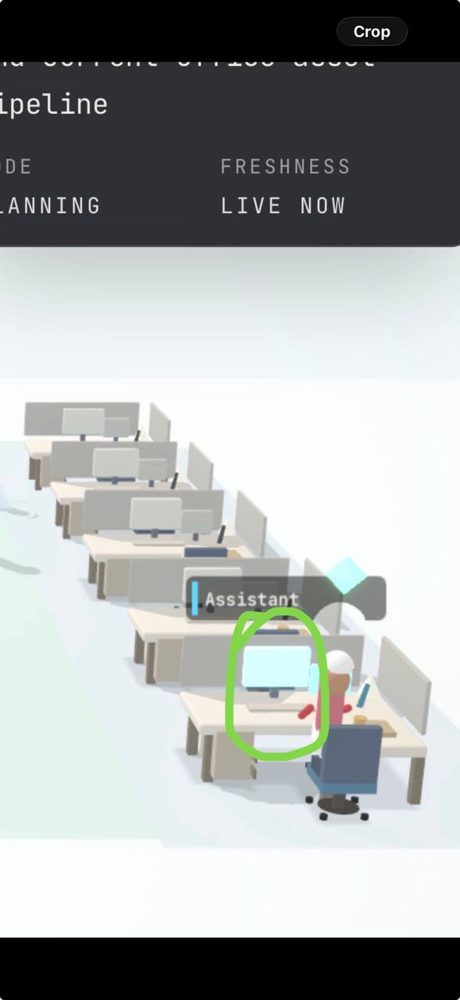

# Watcher

Mission control for multi-agent operations.



## What It Is

Watcher is a self-hosted operations dashboard for agent systems. It gives operators one place to monitor system health, team activity, and execution state, then intervene from the web UI when needed.

## Core Capabilities

- Live mission status with system-level health context
- Interactive Team Office scene for lane/agent visibility
- Authenticated web lane control (select lane, send instruction)
- Live session feed (user, agent, tool events)
- Task runs and flow tracking
- Logs and process visibility
- Telegram sync support
- Mobile-friendly dashboard experience

## Product Surfaces

- `/watch` — primary operations dashboard
- `/office-preview` — public read-only office visualization
- `/docs` — in-app reference

## Security Model

- Authenticated dashboard access
- Public preview intentionally sanitized (no private task text)
- Runtime secrets are environment variables and are not stored in this README

## Tech Stack

- Next.js 14
- React
- TypeScript
- Three.js / react-three-fiber

## Development

```bash
npm install
npm run dev
```

## Build

```bash
npm run build
npm run start
```

## Internal Ops Notes

Operational deployment details, internal paths, and team-specific runbooks are maintained in `README.internal.md`.
